# AGenUI Studio

[](LICENSE)

[中文](README.zh-CN.md) · [Documentation](docs/README.md) · [Changelog](CHANGELOG.md)

AGenUI Studio is a self-hosted workspace for building, running, and iterating on
agent-generated AGenUI interfaces. It includes a visual management console, a
local SQLite knowledge base, configurable APIs/operators/rules, and native
HTTP/SSE integration for production applications.

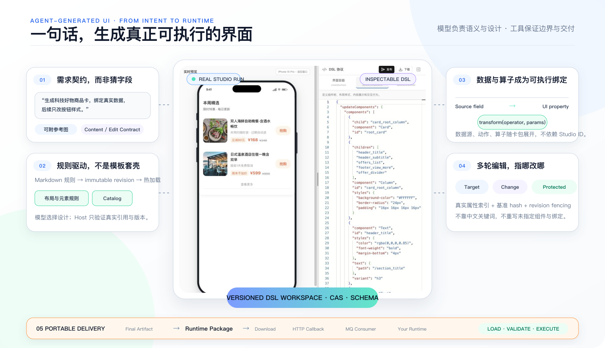

_One real generation path: Contract-first intent, rule-driven design,
data/operator binding, protected multi-turn editing, and a portable Runtime
Package. The center is a public-safe Studio run backed by the included
`demo.offers` source._

## Real generated examples

<table>
  <tr>
    <td>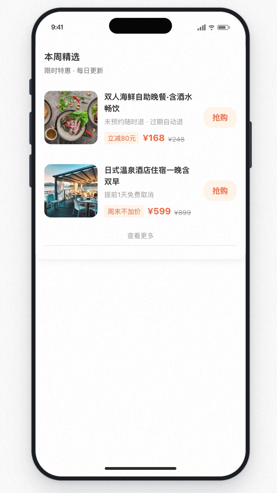</td>
    <td>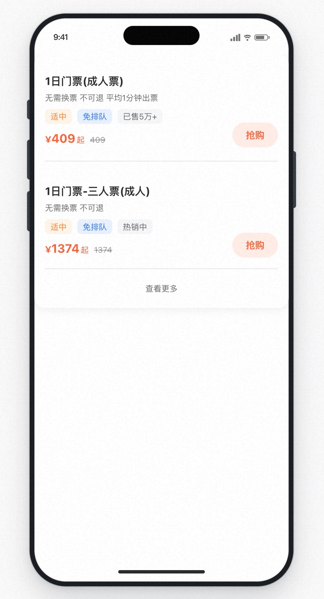</td>
    <td>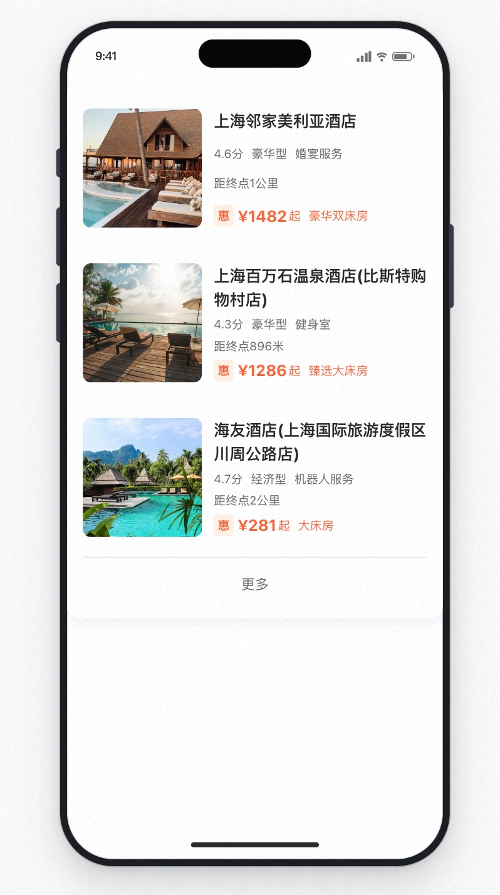</td>
  </tr>
  <tr>
    <td align="center">Media, offers, pricing and a primary action</td>
    <td align="center">Inventory tags, original price and repeated rows</td>
    <td align="center">Hotel results with executable data binding</td>
  </tr>
  <tr>
    <td>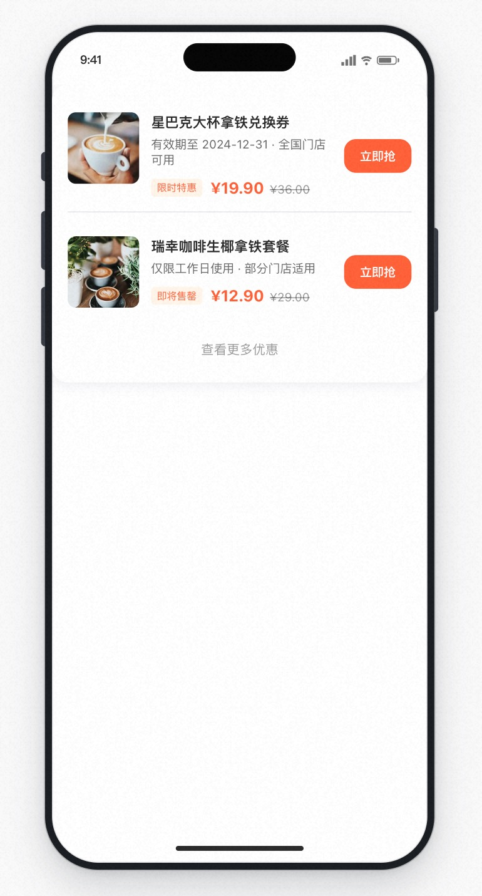</td>
    <td>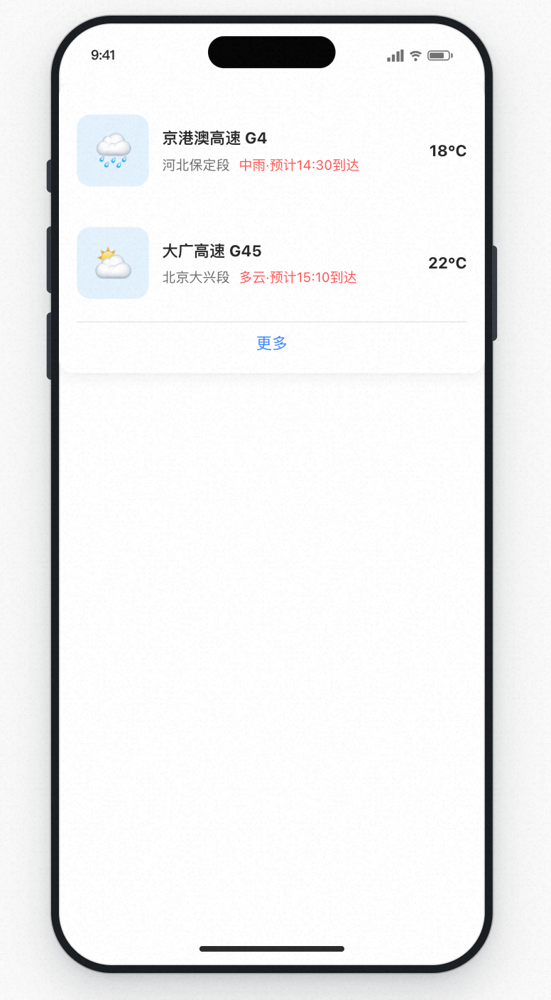</td>
    <td>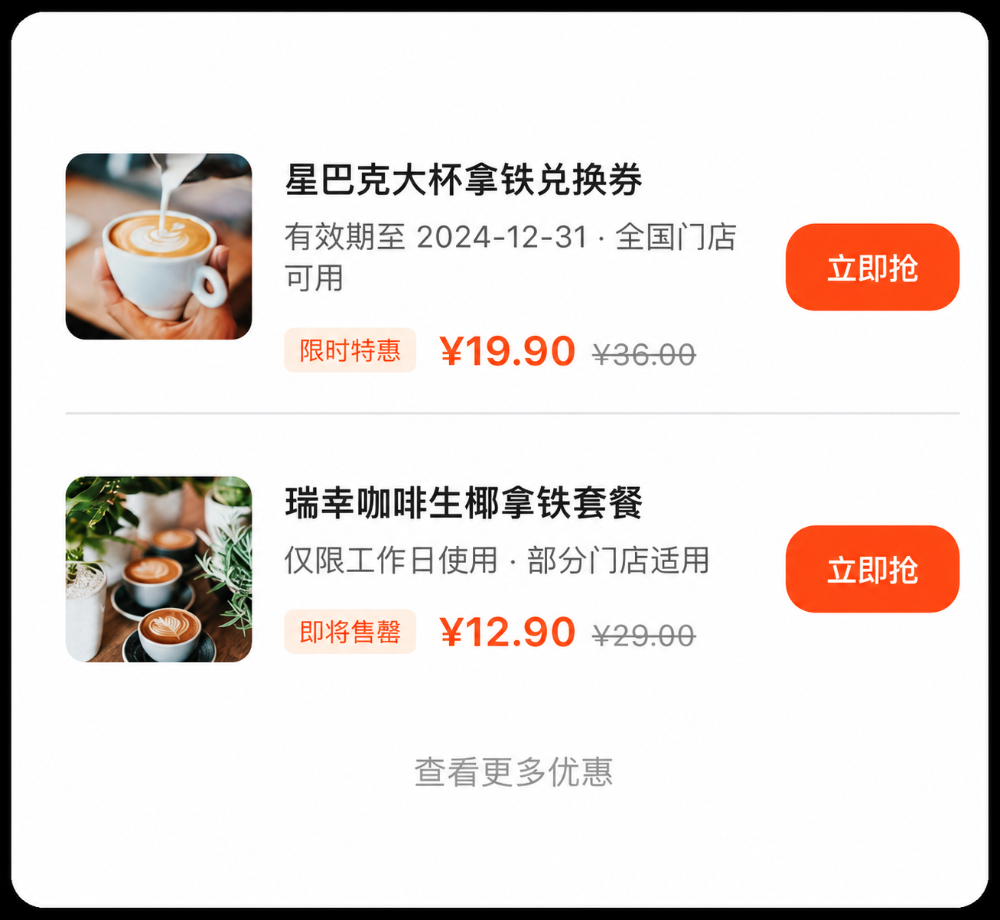</td>
  </tr>
  <tr>
    <td align="center">Media, separators, status, and coupon actions</td>
    <td align="center">Route, weather, alerts, and live status</td>
    <td align="center">Card detail without device chrome</td>
  </tr>
</table>

_The first four images are real Studio runs using configured models, rules, and
Workspace tools, rendered by the included Renderer. The final image removes the
device chrome so layout detail is easier to inspect. Together they exercise
media, repeated lists, prices, labels, actions, and bindings. Original
production references, data, assets, and internal rules are not distributed in
this repository._

## From intent to executable UI

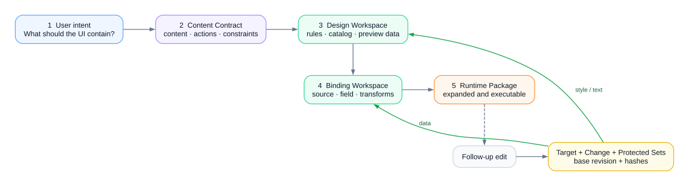

The model decides meaning and design. Versioned Workspace tools constrain how
the DSL is created, bound, and edited; the result is an expanded package that a
Runtime can execute without reconnecting to Studio.

## Reproduce a card from a fresh install

The gallery is not backed by a hidden template or custom application code. Start
with the bundled data, then copy the public [generation prompt, editing prompt,
and small Markdown rule example](docs/reproduction.md). The first prompt creates
a complete preview even before a source exists; the binder reports the mapping
work required for a downloadable package. The editing prompt preserves existing
data and actions while refining only the declared visual target set.

Use a permitted reference image only as visual input. Keep product-specific
assets, business language, and private rules outside the repository; publish a
small, generic rule revision when a visual system needs stable constraints.

## What you can do

- Configure your own OpenAI-compatible or Anthropic Messages API endpoint and
  API key in the UI.
- Generate a card, preview it live, and refine it over multiple turns.
- Download the completed card as a self-contained Runtime Package whose data
  sources, bindings, actions and operators no longer depend on Studio IDs.
- Register a delivery target and publish that package from the workbench;
  callback delivery is built in and MQ adapters share the same delivery port.
- Manage knowledge, API definitions, operators, and design rules from the
  console; start with local demo data and replace any service when needed.
- Keep non-target components, bindings and actions protected during multi-turn edits.
- Embed the self-contained [Card Runtime](runtime/README.md) to execute
  packaged data sources, bindings, and TypeScript operators without a Studio connection.
- Publish parsed Markdown rules as immutable revisions with an atomic active pointer.

## Model compatibility

AGenUI Studio supports user-provided models through OpenAI-compatible Chat
Completions or the Anthropic Messages API. The following models have been
tested by project contributors:

| Model | Protocol | Status |
| --- | --- | --- |
| Qwen (`qwen3.8-max`) | OpenAI-compatible | Verified |
| Claude Opus 4.7 | Anthropic Messages API | Verified |
| GLM-5.2 | OpenAI-compatible | Verified (text only) |
| Kimi K3 | OpenAI-compatible | Verified |
| GPT-5.6 Sol / Terra | OpenAI-compatible | Verified |

Results may vary by model version and provider. The tested GLM-5.2
configuration does not support multimodal input, and exact model IDs depend on
the provider.

## Architecture

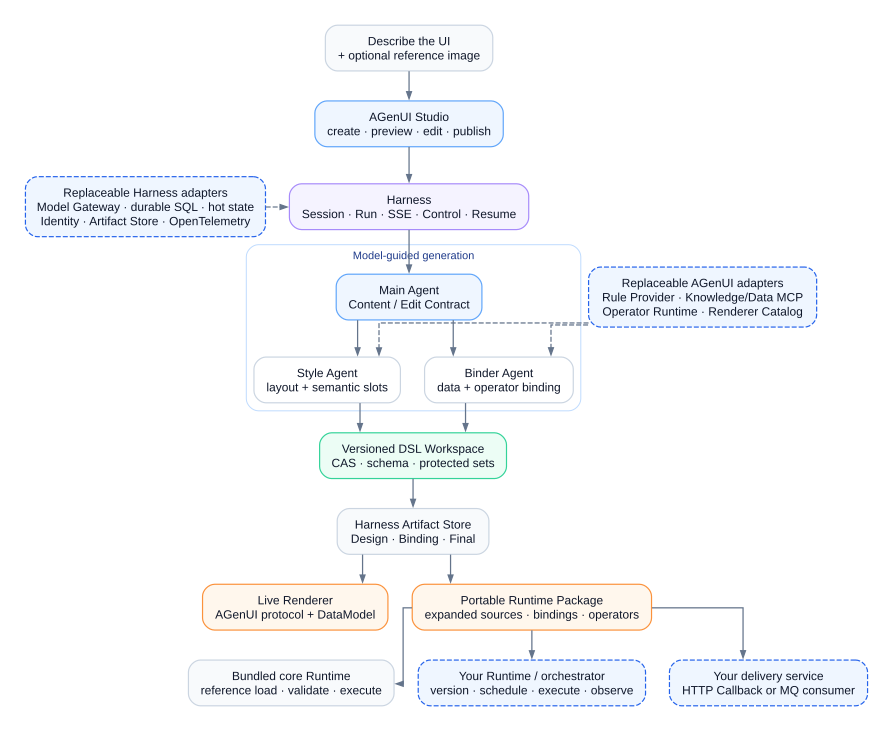

Harness owns durable execution. AGenUI Agents use rules, catalog facts,
knowledge, APIs, and published operators through bounded tools. The Workspace
commits immutable artifacts for live rendering, download, or delivery through
a callback/MQ adapter. Dashed blue boxes are replaceable ports, not required
vendors or fixed implementations.

## Local by default, replaceable by design

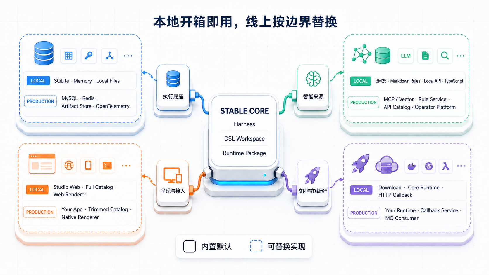

SQLite, BM25, Markdown rules, the Web renderer, and the bundled Runtime make the
first run self-contained. Production deployments can keep the same contracts
while replacing storage with MySQL, hot state with Redis, knowledge or data with
MCP services, operators with a remote runtime, and delivery with a callback
service or MQ consumer. The Runtime Package is portable: the bundled Runtime is
a reference implementation, not a required hosting model.

## Run locally

Requirements: Go 1.26.2+ and Node.js 20+.

```sh
cd web
npm install
cd ..
make dev
```

Open `http://127.0.0.1:3100/admin/home`. In **Settings**, enter your model
endpoint, model name, and API key. Local data is stored under `agenui-agent/var/`
and is ignored by Git. `make dev` idempotently initializes the bundled
knowledge/API/operator fixtures and starts the data service, Agent, and Web UI.

After a successful generation, use **Download Runtime Package** on the session
page. Verify it independently with:

```sh
go run ./runtime/cmd/agenui-runtime /path/to/agenui-session.json
```

## Integrate

The local demo and Agent intentionally share `var/agenui/studio.db`, so a TypeScript
operator saved and published in the console is immediately available to the
Operator Detail API and runtime adapter.

The console uses AGenUI management APIs. Applications can subscribe to native
run events through:

```text
GET /api/v1/sessions/{session_id}/runs/{run_id}/events
Accept: text/event-stream
X-AGenUI-Tenant-ID: <tenant>
X-AGenUI-User-ID: <user>
```

These identity headers are for the local/test profile only. Production must
install an authenticated `PrincipalResolver`.

See [Quick start](docs/quickstart.md), [Card reproduction](docs/reproduction.md), [Configuration](docs/configuration.md),
[Architecture](docs/architecture.md), [Rule documents](docs/rules.md), [Capabilities and acceptance](docs/capabilities.md), [API reference](docs/api-reference.md), and
[Knowledge MCP](docs/knowledge-mcp.md).

## Community & Contact

- **GitHub Issues**: [bug reports and feature requests](https://github.com/acoder-ai-infra/agenui-studio/issues)
- **Email**: [zhangjingcheng.zjc@alibaba-inc.com](mailto:zhangjingcheng.zjc@alibaba-inc.com)
- **DingTalk Group**: Chinese community
- **WeChat Group**: Chinese community

<div align="center">
<table>
  <tr>
    <th>DingTalk Group</th>
    <th>WeChat Group</th>
  </tr>
  <tr>
    <td align="center"></td>
    <td align="center">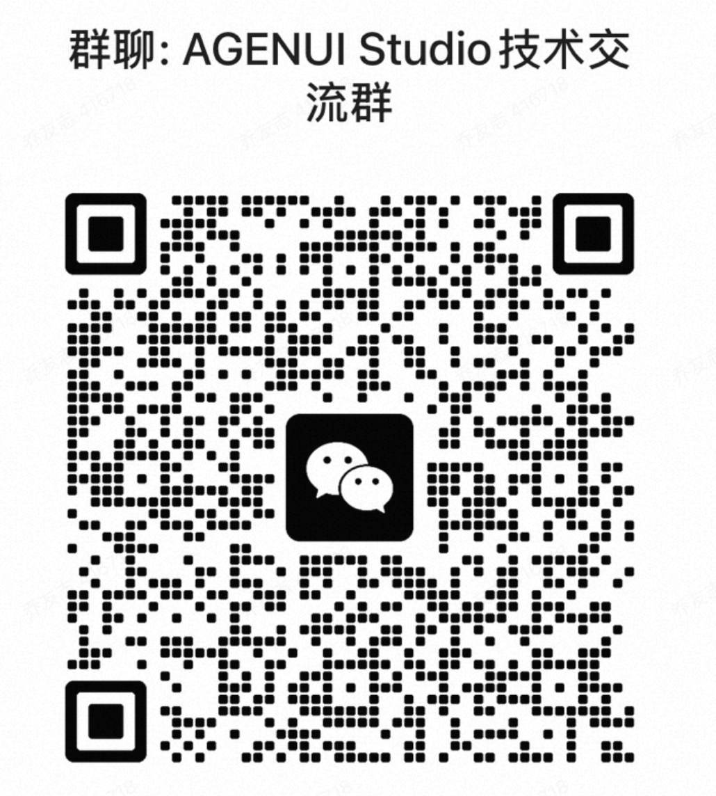</td>
  </tr>
</table>
</div>

---

## License

Apache License 2.0. See [LICENSE](LICENSE).
Third-party attributions are listed in
[THIRD_PARTY_NOTICES.md](THIRD_PARTY_NOTICES.md).

Security reports and contributions are welcome. See [SECURITY.md](SECURITY.md)
and [CONTRIBUTING.md](CONTRIBUTING.md).
