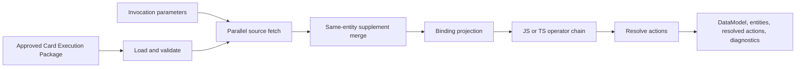

# AGenUI Studio Card Runtime

[简体中文](README.zh-CN.md)

Execute a self-contained Card Execution Package and produce the runtime
`DataModel` consumed by an AGenUI renderer.

AGenUI Studio Card Runtime is a small Go library for the deterministic, data-facing
part of card delivery. Given an approved package and invocation parameters, it
fetches business data, joins same-entity supplements, applies bindings and
JavaScript or TypeScript transforms, and returns data plus structured
diagnostics. It makes no model calls and needs no Studio connection while a
package is running.

## What it does

- Loads and validates a self-contained, versioned Card Execution Package.
- Fetches one primary source and its supplemental sources in parallel.
- Joins supplemental records to primary entities by an explicit `entityKey`.
- Projects complete `fieldPath` values through ordered transforms to complete
  `refKey` destinations.
- Maps wildcard source and target coordinates deterministically without a
  derived destination-classification field.
- Validates every real operator input, parameter object, and output against
  the embedded JSON Schemas.
- Runs ordered JavaScript and TypeScript operator chains with Goja.
- Resolves expanded action payloads and projects them into the DataModel.
- Applies explicit `block`, `hide`, and `fallback` policies for missing data.
- Returns the resolved entities and machine-readable execution diagnostics.
- Lets the host replace HTTP access with its own `Fetcher` implementation.

The package is deliberately not a workflow engine. Source calls are one-level
and parallel; there is no source chaining, cycle, recursion, or general DAG.

## Run the TypeScript example

From the `agenui-studio` directory:

```bash
go run ./runtime/example
```

The example is fully offline. It starts an in-process mock API, loads the
[product package](testdata/sample-package.json), executes two real
TypeScript operators, and prints an AGenUI `DataModel`:

```text
"price": "¥68.00"
"distance": "850m"
"url": "https://example.com/products"
```

No model key, database, or external service is required.

## Use it as a Go library

The Runtime module targets Go 1.26.2 or newer:

```bash
go get github.com/AGenUI/agenui-studio/runtime
```

```go
import (
    "context"
    "os"
    "time"

    "github.com/AGenUI/agenui-studio/runtime"
)

func executeCard(ctx context.Context, path string) (*runtime.Result, error) {
    packageBytes, err := os.ReadFile(path)
    if err != nil {
        return nil, err
    }
    pkg, err := runtime.Load(packageBytes)
    if err != nil {
        return nil, err
    }

    fetcher := runtime.NewHTTPFetcher(5 * time.Second)
    operators := runtime.NewJSExecutor(runtime.ExecutorConfig{
        Timeout:        300 * time.Millisecond,
        MaxInputBytes:  64 * 1024,
        MaxOutputBytes: 64 * 1024,
    })
    engine := runtime.NewEngine(fetcher, operators)

    return engine.Execute(ctx, pkg, map[string]any{
		"query": "city",
		"trace": "example",
    })
}
```

`runtime.NewEngine(nil, nil)` uses the default HTTP fetcher and operator
limits. Production hosts normally provide a restricted `Fetcher` for service
discovery, authentication, network policy, tracing, or deterministic tests.

## Execution model



The package is the complete execution plan. Runtime does not ask a model to
reinterpret bindings or choose APIs at execution time.

### Failure and degradation semantics

| Situation | Result |
| --- | --- |
| Invalid or non-self-contained package | `runtime.Load` fails before execution. |
| Primary source failure | The execution fails. |
| Supplemental source failure | The run continues and records a warning diagnostic. |
| Missing value with `block` | The execution fails. |
| Missing value with `hide` | The target is skipped and an info diagnostic is recorded. |
| Missing value with `fallback` | `fallbackValue` is written. |
| Operator input, execution, or output failure | Execution fails with a structured Runtime error. |
| Context cancellation | Execution returns the context error. |

Paths are intentionally small and predictable: object keys, quoted map keys,
fixed indexes, and at most two wildcard levels are supported. When `refKey`
contains wildcards, the operator chain runs once per matched coordinate. When
`refKey` has no wildcard, the complete `fieldPath` result enters the chain, so
list-to-list and list-to-scalar operators work without implicit Runtime logic.
Filters, scripts, recursive lookup, and fuzzy resolution are unsupported.

## JavaScript and TypeScript operators

An operator is a single script exposing the configured entry function,
normally `run(value, params)`:

```ts
interface PriceParams {
  currency?: string;
  suffix?: string;
}

function run(value: number, params?: PriceParams): string | number {
  const amount = Number(value);
  if (Number.isNaN(amount)) return value;
  return `${params?.currency ?? "¥"}${amount / 100}${params?.suffix ?? "起"}`;
}
```

The corresponding package entry uses `"language": "typescript"` or
`"language": "ts"`. JavaScript operators use `javascript` or `js`.

For TypeScript, Runtime uses esbuild to transform the script to ES2015
JavaScript and then executes it through the same Goja path as JavaScript.
This is syntax transformation, not type checking. Operators therefore have
these constraints:

- one self-contained script with a global entry function;
- no imports, package resolution, Node.js APIs, or filesystem access;
- no TypeScript project or `tsconfig.json` processing;
- JSON-compatible inputs and outputs are strongly recommended.

Each invocation gets a fresh Goja VM. There is no cross-request global state.

## Card Execution Package

The JSON package expands every data source and operator into a complete
definition, so execution does not depend on Studio-side IDs or lookups. It
contains the frozen content contract, AGenUI protocol, data sources, bindings,
operators, actions, and provenance metadata.

- [Normative Runtime contract](SPEC.md)
- [Runtime Package JSON Schema](package.schema.json)
- [Runnable TypeScript sample package](testdata/sample-package.json)

`runtime.Load` enforces required identity/protocol fields, exactly one primary
source, complete Binding paths, deterministic wildcard correspondence,
declared operator references and hashes, operator schemas, and invocation
parameters before fetching any source.

Run a downloaded package directly:

```bash
go run ./runtime/cmd/agenui-runtime /path/to/package.json
```

## Host responsibilities

Runtime owns deterministic package execution. The embedding service owns:

- package provenance, approval, signature, version selection, and rollback;
- retries, caching, rate limits, circuit breakers, and traffic policy;
- outbound network allowlists and API credentials;
- concurrency admission, per-package budgets, metrics, and tracing;
- process isolation when packages or operators are not trusted.

The default `HTTPFetcher` is convenient for local use but trusts endpoints
declared by the package. Do not expose it to unreviewed packages without a
network policy or custom `Fetcher`.

## Limits and security boundary

| Control | Default |
| --- | --- |
| HTTP request timeout | 10 seconds |
| HTTP response read limit | 4 MiB |
| Operator timeout | 200 milliseconds |
| Operator value-input limit | 64 KiB |
| Operator output limit | 64 KiB |
| VM lifecycle | Fresh Goja VM per invocation |

These controls prevent common accidental failures; they are not a hostile-code
memory or OOM isolation boundary because Goja executes inside the host process.
The engine also starts one goroutine per declared source and does not impose a
package-wide source-count limit. Validate package size and run untrusted work
inside a separately resource-limited worker process.

See [Limits and security boundary](#limits-and-security-boundary) before deployment.

## Compatibility and boundaries

Package `2.0` is a deliberate clean contract: data Bindings contain `refKey`
and `transforms`; truncated `target` and derived destination classification are
not accepted by the Go type. TypeScript remains a preprocessing layer before
the same Goja executor, not a second operator runtime.

This directory is an embeddable execution library. It does not include the
package assembly/publication control plane, and the AGenUI Studio console does not
currently expose it as a production online execution service.

The project is currently a public preview. The Package schema is version
`2.0`; Go APIs may still evolve before a stable module release.

## Verify

```bash
go test ./runtime/...
go test -race ./runtime/...
go vet ./runtime/...
go run ./runtime/example
./runtime/scripts/check-coverage.sh
```

Run `make verify` from the `agenui-studio` directory for the full repository release
validator.

## Contributing and license

Bug reports, tests, documentation improvements, and focused runtime
changes are welcome. Runtime behavior changes should document compatibility
impact and include deterministic tests.

AGenUI Studio is licensed under the [Apache License 2.0](../LICENSE).
