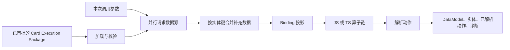

# AGenUI Studio 卡片 Runtime

[English](README.md)

执行一份自包含的 Card Execution Package，生成 AGenUI Renderer 可直接消费的运行态
`DataModel`。

AGenUI Studio 卡片 Runtime 是一个小而明确的 Go Library，负责卡片交付链路中确定性的“数据执行”
部分。输入一份已经审批的 Package 和本次调用参数，它会请求业务数据、合并同实体补充
信息、执行 Binding 投影与 JavaScript/TypeScript 转换，最后返回数据和结构化诊断。
整个执行过程不调用模型，也不依赖 Studio 在线服务。

## 核心能力

- 加载并校验自包含、可版本化的 Card Execution Package；
- 并行请求一个主数据源和多个补充数据源；
- 通过显式 `entityKey` 把补充记录合并到主实体；
- 将完整 `fieldPath` 真实值经过有序算子链投影到完整 `refKey`；
- 按源/目标 wildcard 坐标确定性映射，不依赖派生的目标分类字段；
- 每次执行时使用 Package 内嵌 JSON Schema 校验算子输入、参数和输出；
- 通过 Goja 顺序执行 JavaScript/TypeScript 算子链；
- 解析已展开的动作载荷并投影到 DataModel；
- 对缺失数据执行明确的 `block`、`hide`、`fallback` 策略；
- 返回解析后的实体和机器可读的执行诊断；
- 允许宿主通过 `Fetcher` 接入自己的网络、鉴权和 Mock 实现。

它有意不做通用工作流引擎。数据源只支持单层并行组合，不支持数据源串联、循环、递归
或通用 DAG。

## 运行 TypeScript 示例

在 `agenui-studio` 目录执行：

```bash
go run ./runtime/example
```

示例完全离线运行：它会启动进程内 Mock API，加载
[商品 Package](testdata/sample-package.json)，执行两个真正带类型声明的
TypeScript 算子，并输出 AGenUI `DataModel`：

```text
"price": "¥68.00"
"distance": "850m"
"url": "https://example.com/products"
```

不需要模型密钥、数据库或任何外部服务。

## 作为 Go Library 接入

Runtime Module 要求 Go 1.26.2 或更高版本：

```bash
go get github.com/AGenUI/agenui-studio/runtime
```

```go
import (
    "context"
    "os"
    "time"

    "github.com/AGenUI/agenui-studio/runtime"
)

func executeCard(ctx context.Context, path string) (*runtime.Result, error) {
    packageBytes, err := os.ReadFile(path)
    if err != nil {
        return nil, err
    }
    pkg, err := runtime.Load(packageBytes)
    if err != nil {
        return nil, err
    }

    fetcher := runtime.NewHTTPFetcher(5 * time.Second)
    operators := runtime.NewJSExecutor(runtime.ExecutorConfig{
        Timeout:        300 * time.Millisecond,
        MaxInputBytes:  64 * 1024,
        MaxOutputBytes: 64 * 1024,
    })
    engine := runtime.NewEngine(fetcher, operators)

    return engine.Execute(ctx, pkg, map[string]any{
		"query": "city",
		"trace": "example",
    })
}
```

`runtime.NewEngine(nil, nil)` 会使用默认 HTTP Fetcher 和算子限制。生产宿主通常应提供
受限的 `Fetcher`，以接入服务发现、身份认证、网络策略、链路追踪或确定性测试。

## 执行模型



Package 就是完整执行计划。Runtime 在执行期不会再调用模型重新理解 Binding，也不会
重新选择 API。

### 失败与降级语义

| 场景 | 结果 |
| --- | --- |
| Package 非法或不自包含 | `runtime.Load` 在执行前失败。 |
| 主数据源失败 | 本次执行失败。 |
| 补充数据源失败 | 继续执行，并记录 Warning Diagnostic。 |
| 缺失值策略为 `block` | 本次执行失败。 |
| 缺失值策略为 `hide` | 跳过目标，并记录 Info Diagnostic。 |
| 缺失值策略为 `fallback` | 写入 `fallbackValue`。 |
| 算子输入、执行或输出失败 | 返回结构化 Runtime 错误并中止执行。 |
| Context 被取消 | 返回对应的 Context Error。 |

路径保持小而确定：支持对象 Key、带引号的固定 Map Key、固定数组下标，以及最多两层
wildcard。`refKey` 含 wildcard 时，对每个匹配坐标独立执行算子链；`refKey` 不含
wildcard 时，完整 `fieldPath` 结果进入算子链，因此可执行 list→list 和 list→scalar
算子。禁止过滤器、脚本、递归查找和模糊字段解析。

## JavaScript 与 TypeScript 算子

一个算子是一段暴露指定入口函数的单文件脚本，入口通常为
`run(value, params)`：

```ts
interface PriceParams {
  currency?: string;
  suffix?: string;
}

function run(value: number, params?: PriceParams): string | number {
  const amount = Number(value);
  if (Number.isNaN(amount)) return value;
  return `${params?.currency ?? "¥"}${amount / 100}${params?.suffix ?? "起"}`;
}
```

对应 Package 条目的 `language` 使用 `typescript` 或 `ts`；JavaScript 使用
`javascript` 或 `js`。

TypeScript 算子会先通过 esbuild 转成 ES2015 JavaScript，再进入与 JavaScript 完全
相同的 Goja 执行路径。这里做的是语法转换，不是类型检查，因此算子需要遵守：

- 使用一段自包含脚本，并在全局暴露入口函数；
- 不支持 Import、包解析、Node.js API 或文件系统；
- 不读取 TypeScript Project 或 `tsconfig.json`；
- 强烈建议输入输出保持 JSON 兼容。

每次算子调用都会创建新的 Goja VM，不会跨请求共享全局状态。

## Card Execution Package

Package JSON 会把每个数据源和算子引用展开为完整定义，执行时不依赖 Studio 内部 ID
或二次查询。它包含冻结的 Content Contract、AGenUI Protocol、数据源、Binding、算子、
Action 和用于追溯的元数据。

- [Runtime 规范](SPEC.md)
- [Runtime Package JSON Schema](package.schema.json)
- [可运行的 TypeScript 示例 Package](testdata/sample-package.json)

`runtime.Load` 会在请求数据源前校验必要身份与 Protocol 字段、唯一主数据源、完整 Binding
路径、wildcard 确定性对应、算子引用与哈希、算子 Schema 以及调用参数。

可直接运行下载文件：

```bash
go run ./runtime/cmd/agenui-runtime /path/to/package.json
```

## 宿主职责

Runtime 负责确定性执行 Package；接入它的宿主服务负责：

- Package 来源、审批、签名、版本选择和回滚；
- 重试、缓存、限流、熔断和流量策略；
- 出网白名单和 API 凭证；
- 并发准入、单 Package 预算、指标和链路追踪；
- Package 或算子不可信时的进程级隔离。

默认 `HTTPFetcher` 便于本地开发，但会信任 Package 声明的 Endpoint。不要在缺少网络
策略或自定义 `Fetcher` 的情况下执行未经审核的 Package。

## 默认限制与安全边界

| 控制项 | 默认值 |
| --- | --- |
| HTTP 请求超时 | 10 秒 |
| HTTP 响应读取上限 | 4 MiB |
| 算子执行超时 | 200 毫秒 |
| 算子 Value 输入上限 | 64 KiB |
| 算子输出上限 | 64 KiB |
| VM 生命周期 | 每次调用创建新的 Goja VM |

这些限制能阻止常见的意外故障，但不是恶意代码的内存/OOM 隔离边界，因为 Goja 仍在
宿主进程内执行。Engine 还会为每个声明的数据源创建一个 Goroutine，当前没有
Package 级数据源数量上限。部署方应限制 Package 规模，并把不可信任务放进独立、受
资源限制的 Worker 进程。

部署前请阅读本节的安全边界说明。

## 兼容性与范围

Runtime 保持原有的 Package 执行顺序和 JavaScript 行为。TypeScript 支持只是进入原
Goja Executor 前的预处理层，并没有引入第二套算子 Runtime。

当前目录提供的是可嵌入的执行 Library，不包含 Package 组装/发布控制面；AGenUI Studio 控制台
目前也没有把它暴露成生产在线执行服务。

Package `2.0` 是一次明确的干净契约：数据 Binding 使用 `refKey` 和 `transforms`，不再
接收被截断的 `target` 或派生目标分类字段。项目当前处于 Public Preview 阶段；Go API 在稳定版发布
前仍可能演进。

## 验证

```bash
go test ./runtime/...
go test -race ./runtime/...
go vet ./runtime/...
go run ./runtime/example
./runtime/scripts/check-coverage.sh
```

如需执行整个仓库的发布门禁，请在 `agenui-studio` 目录运行 `make verify`。

## 参与贡献与许可证

欢迎提交 Bug、测试、文档改进和边界明确的 Runtime 变更。Runtime 行为变更应说明
兼容性影响，并提供确定性测试。

AGenUI Studio 使用 [Apache License 2.0](../LICENSE) 开源。
